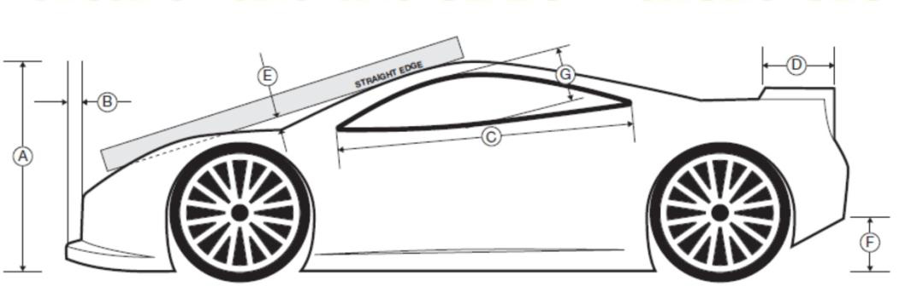

# Klassregler 1/8 GTe
INT: based on Klassregler 1/8 IC OFF Road

Sweden GTe följer SBF:s tekniska regler för radiostyrd bilsport. Reglerna nedan ska
tolkas som klasspecifika regler för 1/8 GTe. Se även [Tekniska regler Radiostyrd Bilsport](https://www.sbf.se/Regler/Radiostyrdbilsport/)

## Allmänt
*Blank*
## Bana och banbeläggning
- Banbeläggningen ska vara jämn asfalt med släta skarvar. Minimilängden är 200 meter (240 – 300 rekommenderas). Banan ska begränsas av kantlinjer som måste vara 8 - 10 cm breda och antingen vita eller gula. Minimibredden på banan mellan kantlinjerna ska vara 4 meter och max bredden 6,5 meter. Det bör finnas minst en raksträcka på ca 45 meter. 
- En streckad linje kan dras mitt i banan på raksträckan för att banan ska synas bättre. I kurvorna får inga linjer utöver kantlinjerna finnas. Le Mans start ska användas och det ska finnas tio numrerade rutor i kanten av banan i 20 - 45 graders vinkel mot banan och med minst 5 meters mellanrum. På redan befintliga banor ska avståndet hållas så nära dessa mått som möjligt. Rutorna bör vara 70 - 100 cm långa och 30 - 40 cm breda. 

## Banbestämmelser
För generella bestämmelser, se RB 18.
## Tekniska specifikationer
Gemensamma tekniska regler se RB-T 1.0

För laddningsregler se RB-T 1.5

### Allmänt
- Chassi får endast vara aluminiumchassi i ett stycke. Karossfästen får inte vara på bärarmar eller andra rörliga ställen. Bilen måste vara utrustad med 4WD (4 wheel drive), “wishbone suspension” och differential.
### Antenn
- Antennen måste vara av böjligt material.

### Fartreglage
- Alla typer av fartreglage kan användas men de får inte störa varvräkningssystemet.
- Fartreglaget måste rymmas inom bilen och får inte sticka ut genom karossen. Inga yttre
sensorer, (magnetiska. optiska, mekaniska eller gyro) som känner av hastighet på hjul, drev
etc. får finnas.
- Back måste vara bortkopplad.
- Måste vara / har varit en kommersiellt tillgänglig produkt.
### Motor
- Max 2400 kv eller 2400 rpm / volt
- Måste vara / har varit en kommersiellt tillgänglig produkt.
### Broms och koppling
- Inga extra bromssystem är tillåtet att användas utöver elmotorn & ESC även kallat “friction brake”.

- Bilen ska vara utrustad med en differential på både fram & bakaxel och drivas med fyrhjulsdrift. Kraftöverföringen mellan fram & bakaxel måste ske genom en eller flera kardanaxlar. Ingen form av remdriven överföring är tillåten. Alla hjul måste vara kopplade direkt till en differential via en kardanaxel och måste kunna drivas av elmotorn.

- Ingen one-way, spools, låsning genom "Torsion-type" eller externt justerbara differentialer är tillåtna. Differentialerna får inte vara en kuldiff och får endast justeras med silikonbaserad vätska. Utväxlingarna i differentialen fram & bakaxel måste vara identiska. Ingen form av underdrive eller overdrive fram eller bak är tillåten. Bilen måste bibehålla det ursprungliga drivsystemets uppbyggnad & funktion.

### Däck
*Blank*
### Kaross
- Bumpern ska vara tillverkad av ett flexibelt material och ha rundade hörn. Används bumper bak ska denna vara utförd på samma sätt och av flexibelt material.
#### Vinge
*Blank*
### Mått och vikt
Alla mått ska tas när bilen är körklar och chassiplattan är nedtryckt mot marken om inte annat anges.

| GTe                 | Mått                                                                                   |
|---------------------|----------------------------------------------------------------------------------------|
| **Bredd total** | min 300 mm, max 310 mm |
| **Längd total** | max 590 mm |
| **Hjulbas** | min 320 mm, max 379 mm |
| **Höjd total kaross (A)**  | min 135 mm, max 175 mm (utan vinge) |
| **(B)** | max 15 mm |
| **(D)** | max 50 mm |
| **(F)** | max 55 mm |
| **(G)** | min 47 mm |
| **Vikt** | min 3800 g |
---
Copyright (c) 2019, 2022, LargescaleSE and/or its affiliates. All rights reserved.
